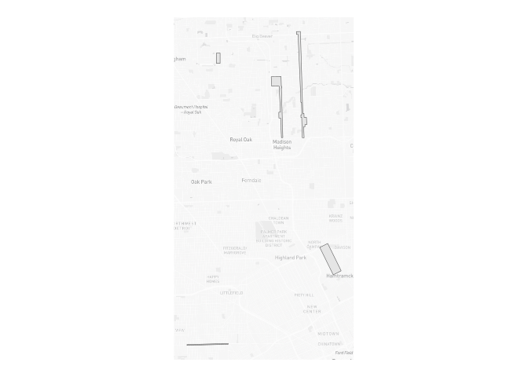
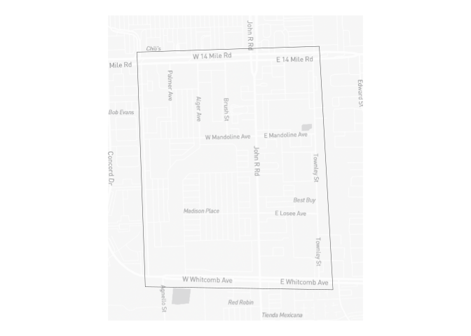
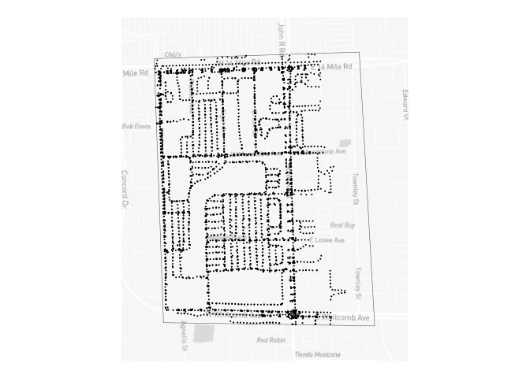
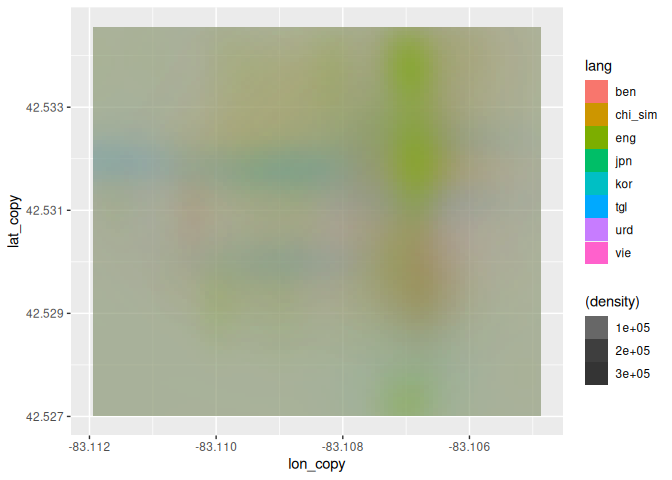
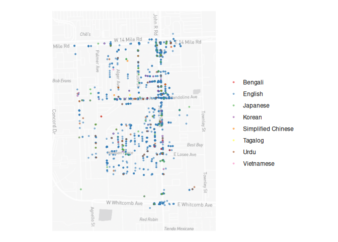
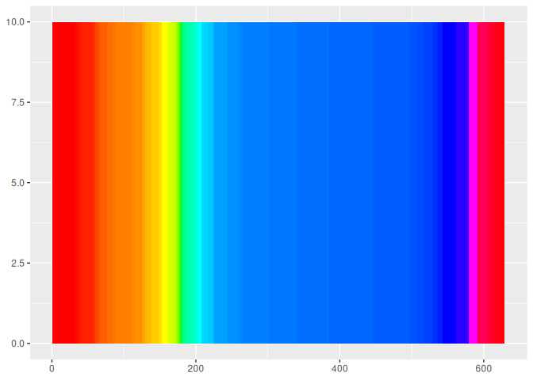

figures
================
2024-04-05

# Figure 1: Polygons to illustrate region of study

<!-- -->

# Figure 1a:

<!-- -->

# Figure 1b:

<!-- -->

# Figure 2: Example Panoid with text box highlights to show recognition

# Figure 3: Heatmap by detected language

<!-- --><!-- -->

# Figure 4: Figure 3, with detected colors

For now – just trying to wrap my head around how a continuous color
space can be represented in an interpretable manner.

<!-- -->

# Table 1: Summary stats

| Statistic                                 |  Value |
|:------------------------------------------|-------:|
| Number of scraped images for bounding box |   3365 |
| Number processed via OCR so far           |    633 |
| Total number of phrases identified        | 143593 |
| Total number of phrases after filtering   |   1872 |

# Table 2: Summary stats of OCR by language

| language           | Recognized phrases | Average length of phrase (characters) | Number of panoramas with recognized text | Average confidence in recognition | Average area in image |
|:-------------------|-------------------:|--------------------------------------:|-----------------------------------------:|----------------------------------:|----------------------:|
| Bengali            |                  9 |                              3.222222 |                                        9 |                          76.82085 |              1109.444 |
| English            |               1631 |                              5.659105 |                                      570 |                          84.99013 |              3174.475 |
| Japanese           |                 80 |                              4.025000 |                                       66 |                          77.53430 |              3512.300 |
| Korean             |                 30 |                              5.066667 |                                       28 |                          77.92863 |              3977.100 |
| Simplified Chinese |                 13 |                              5.307692 |                                       13 |                          76.19490 |              9432.154 |
| Tagalog            |                  6 |                              4.166667 |                                        6 |                          77.95353 |              1313.167 |
| Urdu               |                 75 |                              3.693333 |                                       69 |                          76.74792 |              1406.493 |
| Vietnamese         |                 28 |                              4.500000 |                                       27 |                          80.41953 |              4586.464 |

# Table 2: Summary stats of color analyses
